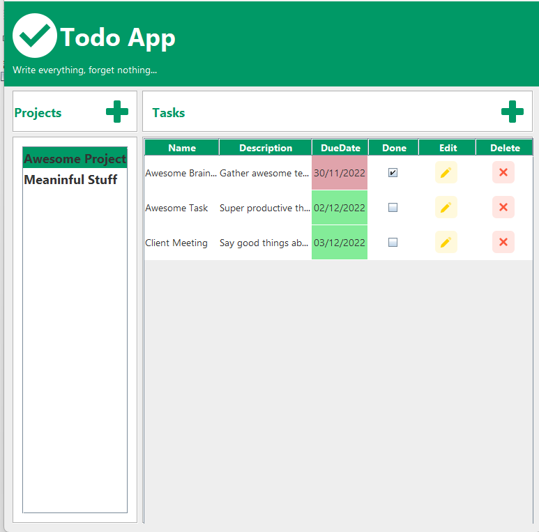

# Todo App

> Task manager application with project separation. I used this project to develop Java skills, and as training opportunity on the development of a fully functional application to the end user.

### Further development

The current state already fullfils all the project requirements. However, that are many opportunities to develop the idea even further and and new  funcionalities:

- [x] Create projects
- [x] Add new projects and tasks 
- [x] Delete tasks
- [ ] Edit tasks/projects
- [ ] Improve the layout
- [ ] Delete Projects
- [ ] ...

## 💻 Requirements

Before stating, make sure your system fulfill the following requirements:

* Active MySQL server on 3306 port
* Java JDK 18.0.2.1 or newer 

## 🚀 Before using the Application

Run the file db.sql file on your MySQL server to create the necessary database and tables.

## ☕ Using the To Do App

The easiest way to run the project is to open it with a Java IDE (as NetBeans) and run the file App.java

## 😄 Contribute 

Want to contribute? 
Feel free to clone, add new functionalities and create a pull request.

